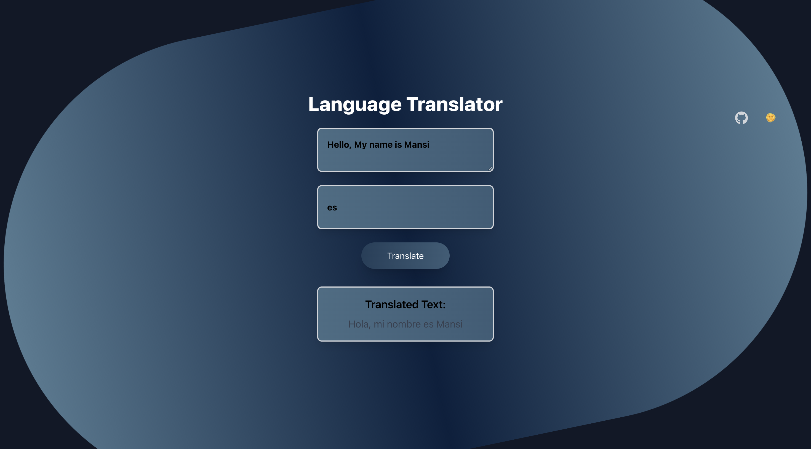

<h1 align="center">🌐 Language Translator App</h1>

  
  
  

  
  

A simple, intuitive, and responsive language translator app built with <strong>React</strong> and <strong>Axios</strong>. This app lets you input text and select a target language to instantly see the translation. With a smooth, dark-mode toggle feature and GitHub icon linking to the developer's profile, the app is designed to be user-friendly and visually appealing.

 
 
--- 
 
<h2>🚀 Features</h2>

<ul>
  <li><strong>Real-Time Translation:</strong> Translate text to various languages with a single click.</li>
  <li><strong>Dark Mode Toggle:</strong> Seamlessly switch between dark and light modes.</li>
  <li><strong>Responsive Design:</strong> Optimized for both desktop and mobile devices.</li>
  <li><strong>GitHub Integration:</strong> Access the developer's GitHub profile directly from the app.</li>
</ul>

 
 
---

<h2>🌍 Supported Languages</h2>

This app supports translation for a wide range of languages. Enter the target language code (e.g., <code>en</code> for English, <code>es</code> for Spanish) to see the translated text.

<table align="center">
  <tr>
    <th>Language</th>
    <th>Code</th>
  </tr>
  <tr>
    <td>English</td>
    <td><code>en</code></td>
  </tr>
  <tr>
    <td>Spanish</td>
    <td><code>es</code></td>
  </tr>
  <tr>
    <td>French</td>
    <td><code>fr</code></td>
  </tr>
  <tr>
    <td>German</td>
    <td><code>de</code></td>
  </tr>
  <tr>
    <td>Chinese (Simplified)</td>
    <td><code>zh</code></td>
  </tr>
  <tr>
    <td>Japanese</td>
    <td><code>ja</code></td>
  </tr>
  <tr>
    <td>Korean</td>
    <td><code>ko</code></td>
  </tr>
  <tr>
    <td>Russian</td>
    <td><code>ru</code></td>
  </tr>
  <tr>
    <td>Hindi</td>
    <td><code>hi</code></td>
  </tr>
  <tr>
    <td>Portuguese</td>
    <td><code>pt</code></td>
  </tr>
</table>

...and many more!

 

---

<h2>📸 Screenshots</h2>

  
  

 

---

<h2>🛠️ Technologies Used</h2>

<ul>
  <li><strong>React:</strong> Frontend framework for building the user interface.</li>
  <li><strong>Axios:</strong> For making HTTP requests to the backend API.</li>
  <li><strong>Tailwind CSS:</strong> Utility-first CSS framework for quick and responsive styling.</li>
  <li><strong>Node.js:</strong> Backend server setup for the translation API (localhost:5000).</li>
</ul>

 

--- 

<h2>🔧 Installation & Setup</h2>

<pre>
  <code>
    # Clone the repository
    git clone https://github.com/mansi2804/language-translator-app.git

    # Navigate to the project directory
    cd language-translator-app

    # Install dependencies
    npm install

    # Start the app
    npm start
  </code>
</pre>

Ensure that the backend translation API is running on <code>http://127.0.0.1:5000/translate</code> for the app to work properly.

 

---

<h2>🎨 How to Use</h2>

<ol>
  <li>Enter the text you want to translate in the provided text area.</li>
  <li>Specify the target language code from the supported languages above.</li>
  <li>Click on the "Translate" button to get the translated text instantly.</li>
  <li>Use the top-right toggle to switch between dark and light themes.</li>
</ol>

 

---

<h2>💬 Contact</h2>

If you have any questions or feedback, reach out via <a href="https://github.com/mansi2804">GitHub</a>.

 

Happy Translating! 🌏

